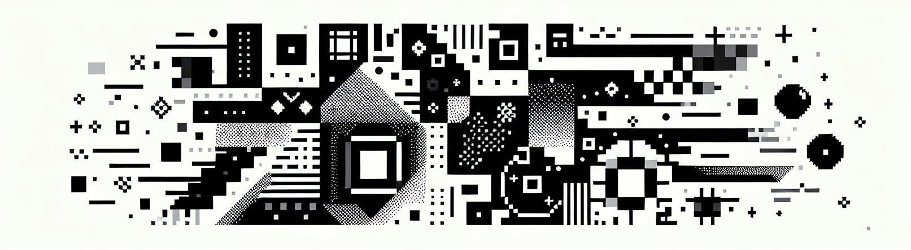

## こんにちは、白熱です！👋

<pre align="right"><a href="README_CN.md">中文</a> ・ <a href="README.md">English</a> ・ 日本語</pre>

  <picture>
    <source media="(prefers-color-scheme: dark)" srcset="assets/dark.png">
    <source media="(prefers-color-scheme: light)" srcset="assets/light.png">
    
  </picture>

  <samp>
    <a href="https://asaki.me" target="_blank" rel="noopener noreferrer">
      ブログ
    </a>
    ・
    <a href="https://discordapp.com/users/__jikkai__" target="_blank" rel="noopener noreferrer">
      Discord
    </a>
    ・
    <a href="https://x.com/yoruhato" target="_blank" rel="noopener noreferrer">
      Twitter
    </a>
    ・
    <a href="https://space.bilibili.com/132248" target="_blank" rel="noopener noreferrer">
      Bilibili
    </a>
  </samp>

 

  

##

エレガントで高性能な Web アプリケーションと開発者ツールの構築に情熱を注ぐフルスタック開発者です。
技術的卓越性とユーザー体験の交差点で活動し、開発者の生産性と創造性を高めるツールを作り出しています。

### 💻 技術スタック

**コア技術：** TypeScript / JavaScript / Rust, React / Vue / Svelte / Solid.js, Next.js / Nuxt.js
**専門分野：** コンポーネントライブラリ、フロントエンドエンジニアリング、パフォーマンス最適化、開発者体験
**ツール・インフラ：** モダン Web ツールチェーン、CI/CD、オープンソースメンテナンス

### 🧩 オープンソース貢献

**[Univer](https://github.com/dream-num/univer) コアメンバー** — オープンソースオフィススイート＆コラボレーションフレームワーク
- 12k+ スターを持つエンタープライズグレードのスプレッドシート SDK
- 大手企業にカスタムオフィスソリューション構築のために採用
- UI パフォーマンス、アクセシビリティ、コミュニティエンゲージメント、開発者体験の向上に貢献

**[Element UI](https://github.com/elemefe/element) 元メンテナー** — 最も人気のある Vue.js コンポーネントライブラリの一つ
- 数百万人の開発者にサービスを提供する UI フレームワークをメンテナンス
- コンポーネント品質、アクセシビリティ、エコシステムの成長に注力

### 🚀 モチベーション

- クリエイターを支援する**開発者ツール**と**生産性ソフトウェア**の構築
- **エレガントなアーキテクチャ**と**心地よい UX** を融合し、シームレスな体験を創出
- **オープンソースコミュニティ**への貢献と世界中の開発者支援
- **Web 技術**と**創造的表現**の交差点を探求

### 🎮 コードの外で

GITADORA Drummania プレイヤー - 金ネ💛

### 📫 連絡先

上記のプラットフォームからお気軽にご連絡ください。技術記事やソフトウェア開発に関する考察は[ブログ](https://asaki.me)でご覧いただけます。
